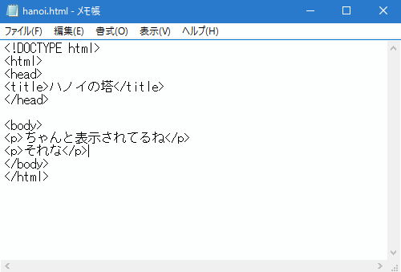
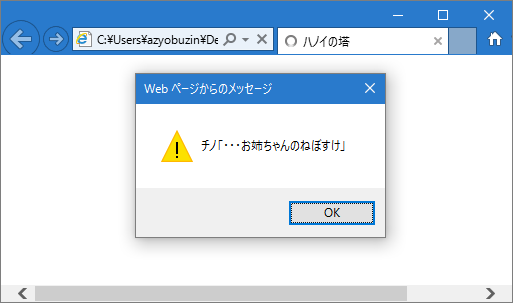
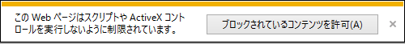
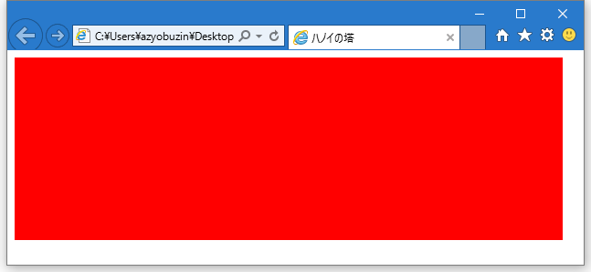
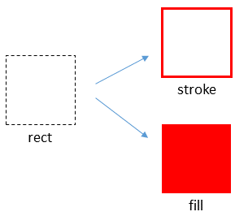

# プログラムで絵を描こう

## 絵を描く領域を用意する
HTMLには`<canvas>`というタグがあります。この`<canvas>`にはコードから自由に絵を描くことができます。
さっそく配置してみましょう。

まず、`<body>`から`</body>`の間を消して、そこに
```html
<canvas id="screen" width="600" height="200"></canvas>
```
と入力します。



`id="screen"`はこのタグに「screen」という名前をつけたことになります。後でこれを使ってコード側から`<canvas>`へアクセスします。

`width="600" height="120"`は、幅600px, 高さ200pxの大きさにするよ、という意味です。
タワーを3本建てるのが目標なので、1本あたり200×200のサイズになりますね。

## ？？「ここからが本当のプログラミングだ」
この状態で hanoi.html を保存してブラウザで開く（開いている場合は更新してみましょう）と、まっさらな画面になります。
絵を描くためのキャンバスを用意しただけで、何も描いていないので当然ですね。

`<canvas>`に絵を描くことはHTMLだけでは実現できません。ここでプログラミング言語「JavaScript」の登場です。楽しくなってまいりました（個人的感想）。

`<script>`というタグの中にはJavaScriptで書かれたプログラムを入れることができ、ブラウザで表示した時にそのプログラムが実行されます。

簡単な例で試してみましょう。`</canvas>`の後ろ（`</body>`の前）に次のHTMLを入力してください。
```html
<script>
alert("チノ「・・・お姉ちゃんのねぼすけ」");
</script>
```

そして保存してブラウザで開いてみてください。チノちゃんがかわいかったら成功です。



<div class="warn">
<p>注意: このような画面が出てきたら「ブロックされているコンテンツを許可」をクリックしてください。</p>
<p></p>
</div>

このプログラムの意味を考えてみましょう。ここでは`alert`という命令（関数といいます）を呼び出して、指定した文章を表示させました。
見て分かるように、呼び出し方は`関数名(値)`です。（関数に入力する値のことを引数といいます。）
文章は`""`（または`''`）で括ることで、「文字列」という扱いになります。
最後に`;`をつけることで、一連の動作（ここでは関数の呼び出し）が終わったよ、という印になります。

<div class="advance">
<p>
発展: ここでいう関数とは、数学の関数と似ているようで似ていないものです。
数学の関数は、例えば $$f(x)=x+1$$ と定義すれば、必ず「入力した値+1」が答えとして返って来ますが、
JavaScriptにおける関数は、それだけではなく、「命令」として使うこともできます。
この例では<code>"チノ「・・・お姉ちゃんのねぼすけ」"</code>という値を入力しましたが、「動作」が起こっただけで「結果」はありませんでした。
</p>
</div>

## ここまでの全体のコード
初めてのJavaScript、お疲れ様でした。
ここまでやってきて、 hanoi.html はこのようになっていると思います。
```html
<!DOCTYPE html>
<html>
<head>
<title>ハノイの塔</title>
</head>

<body>
<canvas id="screen" width="600" height="200"></canvas>

<script>
alert("チノ「・・・お姉ちゃんのねぼすけ」");
</script>
</body>
</html>
```

改行やスペースの違いはあまり気にしないでください。むしろ以下のようにスペースを入れてあげる（インデントを下げる）と階層構造がわかりやすくなって読みやすくなります。
```html
<!DOCTYPE html>
<html>
    <head>
        <title>ハノイの塔</title>
    </head>
    <body>
        <canvas id="screen" width="600" height="200"></canvas>

        <script>
            alert("チノ「・・・お姉ちゃんのねぼすけ」");
        </script>
    </body>
</html>
```

ここから先は、`<script>`から`</script>`の間のJavaScriptのプログラムを扱っていきます。

## canvasを塗りつぶしてみる
では本題に戻って`<canvas>`へ絵を描きましょう。

`<script>`の中身をこのようにしてみましょう。
```javascript
var canvas = document.getElementById("screen");
var width = canvas.width;
var height = canvas.height;
var ctx = canvas.getContext("2d");
ctx.beginPath();
ctx.rect(0, 0, width, height);
ctx.fillStyle = "#FF0000";
ctx.fill();
```

そしてブラウザで開くと、`<canvas>`が存在する範囲が赤に染まります。



ここで書き写して動いて満足するだけでは、自分だけでプログラムを書くときに困ってしまいますので、詳しく見ていきましょう。

### varによる変数定義
まず、4回登場している`var 名前 =`という構文、これは「変数の定義」を表しています。
変数とは値をあとで使うために保存しておく箱です。

例えば
```javascript
var x = 1;
var y = x + 1;
alert(y);
```
では、最初に`x`に値`1`が保存されます。
次に`x`の値に`1`を足す、つまり`1 + 1`の結果が`y`に保存されます。
そして`alert`関数の引数として`y`の値、つまり`2`が使用されます。
これらを踏まえて、実行すると「2」とアラートダイアログに表示されます。

数学の`=`は「等しい」という意味ですが、JavaScriptの`=`は右辺の値を左辺に代入するという意味になることに注意してください。

### . は「の」を意味する
わかりやすい例として、2, 3行目の
```javascript
var width = canvas.width;
var height = canvas.height;
```
を見てみましょう。`canvas.width`は変数`canvas`「の」変数`width`を表します。
変数の中に変数が隠れているので、それを引っ張り出してくる、といった具合でしょうか。

同様に1行目を見てみましょう。これも変数`document`の変数`getElementById`を取得しています。
しかも`getElementById`は関数です。つまり呼び出すことができます。
関数の呼び出し方は`関数名(値)`ですから、同じように`document.getElementById("screen")`とすることができます。

`document.getElementById`は引数の文字列に一致する`id`を持つHTMLタグ（要素）を探し、その要素の情報を返します。
`<canvas id="screen"></canvas>`と定義しているので、`document.getElementById("screen")`でこの`<canvas>`を取得できます。

これで、`canvas`変数には`<canvas>`の情報が入っていて、その`<canvas>`の幅と高さがそれぞれ`width`, `height`変数に保存された、ということがわかりました。

### CanvasRenderingContext2Dで絵を描く
見出しに長ったらしい名前を書いてしまいましたが、このプログラムの上では`ctx`と名前をつけたので安心してください。

`canvas.getContext("2d")`で取得した値は、`<canvas>`に絵を描くための核となるものです。ここから先は`ctx`の中の変数（メンバー）を使って絵を描いていくことになります。
正直かなり癖があって、扱いはとても面倒ですが、インターネットの標準を決める偉い人達がそう決めてしまったので仕方ありません。

`ctx`の使い方の流れは

1. パス（形）を指定
2. 線を引いたり色を塗ったり

といった感じになります。



5行目の`ctx.beginPath();`で、「パスの指定を開始するよ」という合図をします。（このように引数を指定しない関数もあります。）

6行目の`ctx.rect(0, 0, width, height);`で四角形のパスを追加しろという命令をします。
引数を4つ取る関数なので`,`で区切って4つ指定しています。
それぞれの引数の意味はそれぞれ、四角形の左上のx座標, y座標, 四角形の幅, 高さです。
座標は左上が$$(0, 0)$$で、xが大きくなるほど右に、yが大きくなるほど**下**になります。

7行目の`ctx.fillStyle = "#FF0000";`では、「これから色を塗るときには赤色を使ってね」と設定しています。
色の指定方法については「HTML カラーコード」で検索してみてください。

最後に8行目の`ctx.fill();`で現在のパスを塗りつぶせという命令をします。

これで「座標$$(0, 0)$$から、幅600、高さ200の四角形を赤色で塗りつぶせ」と命令できました。

<div class="advance">
<p>この先の説明の都合で<code>rect</code>を使いましたが、<code>fillRect</code>で塗るところまで1行でできたりします。</p>
</div>

## 発展
### Q. script は head に書くものじゃないの？
`<head>`内に書くと、まだDOMができあがっていないため、`document.getElementById`が使いものにならないため`<body>`の最後に書きました。

### 発展問題
canvasに自由に絵を描いてみましょう。「html canvas」と検索すると詳しい使い方が出てきます。
また、`ctx`のメンバーにはどのようなものがあるかを確認しておきましょう。
