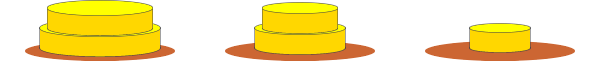
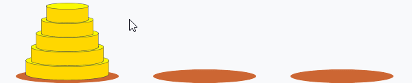

# つくるものを考える
まずは、つくりたいものがどのようなデザインで、どのような機能を持つのかを考えます。

ハノイの塔は、3本の杭と何個かの円盤で遊ぶゲームです。
ただ、杭を描画するのはちょっと面倒な気がするので、このような見た目にするとしましょう。

そして円盤をマウスで動かせるようにしましょう。

このとき円盤を置くことができない場所（移動中の円盤より小さい円盤があるタワー）に置こうとした場合、元の位置に戻るようにします。

左側の5個の円盤をすべて右側に移動できたらクリアとします。

ざっくりですが、完成した形が見えたでしょうか？それではこれを目指して次のステップに行きましょう。

TODO: 別のページに移動させる
# どんなコードが必要かを考える
これらを実現するためにはどのようなコードを書かなければならないでしょうか。

1. 土台の楕円を描画する
2. 円盤を管理する
3. 円盤を表示する
4. 円盤をマウスで移動する
5. クリア条件を満たしているかどうかを判定する

