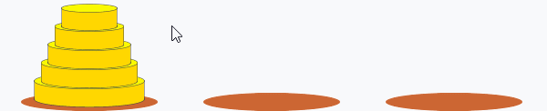

# つくるものを考える
まずは、つくりたいものがどのようなデザインで、どのような機能を持つのかを考えます。

ハノイの塔は、3本の杭と何個かの円盤で遊ぶゲームです。
ただ、杭を描画するのはちょっと面倒な気がするので、このような見た目にするとしましょう。

そして円盤をマウスで動かせるようにしましょう。

このとき円盤を置くことができない場所（移動中の円盤より小さい円盤があるタワー）に置こうとした場合、元の位置に戻るようにします。

左側の5個の円盤をすべて右側に移動できたらクリアとします。

ざっくりですが、完成した形が見えたでしょうか？それではこれを目指して次のステップに行きましょう。
