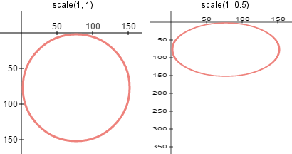
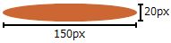
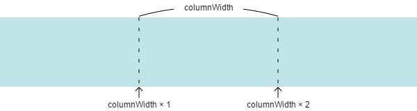

# 土台を描画する

## 楕円を描く関数を用意する
土台の楕円を描いていきましょう。と言いたいところなのですが、残念ながら用意されている関数では正円しか描くことができません。
正円を用いて楕円を描くには、正円を潰したり、伸ばしたりしてやるしかなさそうです。
このゲームでは楕円を多用するので、楕円を描く（正確にはパスを追加するところまで）関数`ellipse`を用意しましょう。

次の関数を`draw`関数の定義の前に書いてください。

```javascript
// cx, cy: 中心座標
// rx: X軸方向の半径, ry: Y軸方向の半径
function ellipse(cx, cy, rx, ry) {
    
}
```

`//`から行の終わりまではコメントという扱いになり、好きにメモを書いておくことができます。

`cx, cy, rx, ry`は呼び出し時の引数が保存される変数で、普通の変数と同じように扱うことができます。

中身が空ですね。1行ずつ説明しながら書き進めましょう。

まずはじめにすることは、座標軸を拡大縮小することです。
`ctx.scale(横の倍率, 縦の倍率)`で行うことができます。



<div class="advance">
<p>発展: この図を生成するやつは<a href="samples/scale.html">こちら</a></p>
</div>

この要領で横方向はそのまま、縦方向の倍率を変えてみることにしましょう。
縦方向を $$\frac{ry}{rx}$$ 倍すればよさそうですね。

```javascript
ctx.scale(1, ry / rx);
```

ここで正円のパスを追加する命令をすれば、勝手に楕円になるわけですね。ではやっていきましょう。
円を描くというより弧を描く関数ですね。このように使います。

```javascript
ctx.arc(中心のX座標, 中心のY座標, 半径, 開始する角度, 終了する角度, 反時計回りか時計回りか)
```

開始する角度を0、終了する角度を $$2\pi$$ (円周率はJavaScriptで`Math.PI`)とすれば円になりますね。
回る方向は円なので関係ないので、とりあえず`false`としておきましょう。

ここで座標軸を拡大縮小したことを思い出してください。
中心のY座標を`cy`にしてしまうと、ずれてしまうので、 $$\frac{ry}{rx}$$ の逆数である $$\frac{rx}{ry}$$ を掛けてあげる必要があります。

これらを踏まえて、円のパスを追加するコードはこのようになります。

```javascript
ctx.arc(cx, cy * rx / ry, rx, 0, 2 * Math.PI, false);
```

これで終わりにしてしまうと、このあとほかの図形を描くときに、この倍率が適用されてしまうので、戻してあげなければいけません。
幸い`ctx.save`という描画設定を保存しておく関数と、`ctx.restore`という保存した設定を取り出すことができる関数があるのでこれらを使っていきましょう。
保存すべき状態は拡大縮小を行う前なので、`ctx.scale`を呼び出す前に
```javascript
ctx.save();
```
を追加します。そして楕円のパスが追加された後で元に戻すよう、最後に
```javascript
ctx.restore();
```
と書けば完成です。

というわけで、関数`ellipse`はこのようになりました。

```javascript
// cx, cy: 中心座標
// rx: X軸方向の半径, ry: Y軸方向の半径
function ellipse(cx, cy, rx, ry)
{
    ctx.save();
    ctx.scale(1, ry / rx);
    ctx.arc(cx, cy * rx / ry, rx, 0, 2 * Math.PI, false);
    ctx.restore();
}
```

<div class="advance">
<p>
発展と愚痴: 難しいゾーンお疲れ様でした。しかしここで皆さんに重要なお知らせがあります。
なんと<code>ctx.ellipse</code>という方法が存在します！！
しかしですね、学校のPCに入ってるInternet Explorer 11、あいつがですね、これに対応してないんですよ！！ふざけんな。
あ、あとFirefoxも。
というわけで、IEよりもっとモダンなブラウザを使っている方は<code>ctx.ellipse</code>を使ってみてください。
使い方を調べるのが発展問題ということで。Mozilla Developer Networkとかにあってみて英語に慣れたりするといいと思います。
</p>
</div>

## ゲームの設定を変数に保存しておく
土台を描くにあたって、まず色や大きさを決めましょう。土台の色は最初で紹介した完成品と同じくこの色にします。

<span style="background-color:#CC6633;display:inline-block;width:20px;height:20px"></span> #CC6633

`<canvas>`の幅が600pxなので、1タワーあたり200px使えるとすると、すこし余白がほしいので、土台は150pxとしましょう。
奥行きがあるように見せたいので楕円として、高さは20pxにします。



これらを変数に保存しておきます。こうしておくことで、後で色や大きさを変更しようと思ったときに、この変数の部分をだけを書き換えれば全体に反映されて、メンテナンス性が高まります。
`var ctx`の次の行にこれらの変数を追加します。

```javascript
var columnWidth = width / 3; // 1列あたりの幅 = 200
var baseWidth = 150; // 土台の幅
var baseHeight = 20; // 土台の高さ
var baseColor = "#CC6633" // 土台の色
```

## ループで土台を描く
土台を3個描かなくてはなりません。あなたならどうしますか？

「3回分プログラムを書けばいいじゃない」、その通りです。
でも、3個とも色を変えたい、形を変えたいと思ったとき、3回書き換えを行わなければなりません。
このように、同じことを繰り返すことを共通化しないで、回数分のプログラムを書くと、あとあと変更しようと思ったときに困ります。
というわけで、繰り返しを共通化する`for`文の書き方を覚えましょう。

まずやりたいことを考えます。3つの楕円を描くとき、中心のX座標は違いますが、そのほかの要素（Y座標, 色, 大きさ）は同じです。
中心のX座標は次のように求められます。

* $$columnWidth \div 2 = columnWidth \times 0 + columnWidth \div 2$$
* $$columnWidth \times 1 + columnWidth \div 2$$
* $$columnWidth \times 2 + columnWidth \div 2$$



つまりこのようにまとめられますね。

$$
columnWidth \times i + columnWidth \div 2 \;\;\; (i = 0, 1, 2)
$$