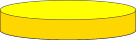
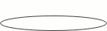
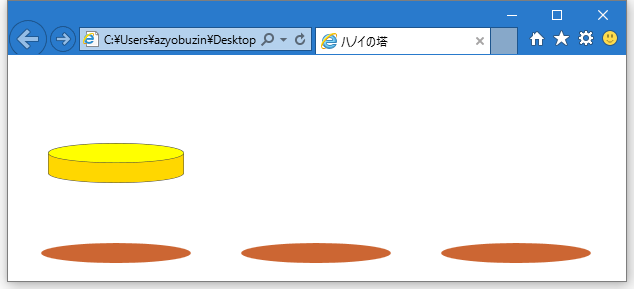
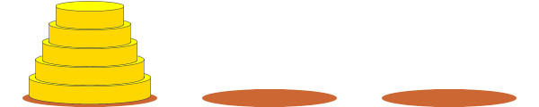
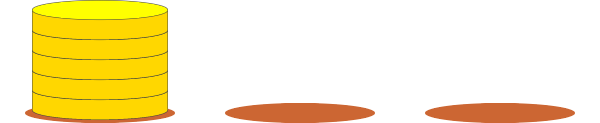

# 円盤を描画する

## ひとつの円盤を描画する
難しいことは小さくして考えることは大事です。というわけで最初は1つだけからやっていきましょう。

まず円盤はこんな感じにします。



これは楕円と四角形の組み合わせでつくることができます。



ここでパスの「追加」と言ってきたのが効いてきます。
底面の楕円と四角形を合せたパスに対して塗りつぶしを行うことで、うまいこと必要な部分だけを塗りつぶせていますね。

それでは、円盤を描画する関数を作っていきましょう。と、その前に円盤についての設定をゲーム設定変数のところに追加しておきましょう。

```javascript
var diskWidth = 135; // 1番大きい円盤の幅
var diskHeight = 20; // 円盤の四角形の高さ
var diskPers = 19; // 円盤の楕円の高さ
var diskColorLight = "#FFFF00"; // 円盤の側面の色
var diskColorDark = "#FFD700"; // 円盤の上面の色
var diskStrokeColor = "#444444" // 円盤の線の色
```

土台よりひと回り小さくしました。それでは`drawBase`関数を作っていきましょう。次のコードを`draw`関数の後に追加します。

```javascript
// n: 円盤番号（大きさ）
// x, y: 中心座標
function drawDisk(n, x, y) {
    var w = diskWidth;
    var ry = diskPers / 2;
    
    // ここから先を説明していきます
}
```

最初は一番大きい円盤だけを描画するので、今は`n`については気にしないでください。
`w`と`ry`はそれぞれ四角形の幅と楕円の縦方向の半径です。これは後で`n`に対する処理を加えるときに変更するので、便宜上変数にしておきました。

まずは線の色を指定しておきましょう。線の色は`ctx.strokeStyle`で指定できます。使い方は`fillStyle`と同じです。
```javascript
ctx.strokeStyle = diskStrokeColor;
```

ではさっきのアニメーションで示した通り、底面・側面・上面の順番で描いていきましょう。まず底面の楕円のパスを追加します。
中心の座標は四角形の下の辺の中心になるので、X座標が`x`、Y座標が`y - (diskHeight / 2)`になりますね（`+`,`-`より`*`,`/`の方が優先されるので括弧はなくても良い）。

```javascript
ctx.beginPath();
ellipse(x, y + (diskHeight / 2), w / 2, ry);
```

ここにさらに側面の四角形のパスを加えます。`rect`の引数に与える座標は四角形の左上の座標なので、
X座標は`x - (w / 2)`、Y座標は`y - (diskHeight / 2)`です。

```javascript
ctx.rect(x - (w / 2), y - (diskHeight / 2), w, diskHeight);
```

そして線を引いて色を塗れば底面と側面のできあがりです。なお、色を塗ってから線を引くと、見えてほしくない線が描かれてしまって見栄えが悪くなるので順番に気をつけましょう。

```javascript
ctx.stroke();
ctx.fillStyle = diskColorDark;
ctx.fill();
```

次に上面を描きます。今度は中心を四角形の上の辺の中心にすれば良いですね。

```javascript
ctx.beginPath();
ellipse(x, y - (diskHeight / 2), w / 2, ry);
ctx.stroke();
ctx.fillStyle = diskColorLight;
ctx.fill();
```

これで`drawDisk`は完成です。`draw`関数から呼び出してみましょう。
前回のループの後に`drawDisk`の呼び出しを追加します。
`n`は一番大きい円盤 = 5番目に大きい円盤ということで`5`にしておきましょう。座標は適当に。

```javascript
drawDisk(5, 100, 100);
```

このようになればOKです。



## 円盤を管理する
円盤は全部で5個あります。これらの情報をひとつひとつ変数にしていったら面倒そうですね。
そこで登場するのが配列です。

配列には値（オブジェクト）を複数個保存することができる入れ物です。

```javascript
var x = [ "a", "b", "c" ];
```

配列はこのように`[]`で囲った中にオブジェクトを`,`区切りで指定することで作成できます。
今、変数`x`には`"a"`, `"b"`, `"c"`の3つの文字列が入っています。
値を取り出すにはこのように書きます。

```javascript
var a = x[0];
var b = x[1];
var c = x[2];
```

`配列[番号]`という書き方ですね（この番号を添字といいます）。このとき一番はじめが`0`から始まることに注意してください。

そして、配列もまたオブジェクトなので、配列の中身として配列を入れることもできます。

```javascript
var x = [ ["a", "b"], [] ];
var b = x[0][1]; // 「xの0番目」の1番目 = "b"
```

それでは、これを活用して、円盤を配列として管理していきましょう。
まずはじめに円盤の表し方を決めます。
ひとつひとつの円盤の違いは大きさだけなので、小さいほうから1,2,3,4,5と番号を振ることにしましょう。
そしてどう配列として扱うかですが、「タワーが円盤を持っている」というふうに扱うと都合が良さそうなので、このようにしましょう。


```javascript
[ [ 5, 4, 3, 2, 1 ], [], [] ]
```


```javascript
[ [ 5, 4 ], [ 3, 2 ], [ 1 ] ]
```

それではプログラムを書いていきましょう。まずゲーム設定変数のところに円盤の個数を書いておきましょう。
```javascript
var diskCount = 5;
```

その次の行に先ほどの配列を保存する変数`rods`を作ります。中身はとりあえず空の配列にしておきましょう（エディタによっては入力支援が受けやすくなったりするかもしれないので）。
```javascript
var rods = [];
```

そして`init`関数内で`rods`の中身を作成します。こうすることでゲーム終了時に最初の状態に戻せますね。
せっかく`diskCount`変数で個数を設定したので、これを使うループをつくりましょう。
5,4,3,2,1という順番で配列に詰めていきたいので、ループは`diskCount`からスタートして、1ずつ減らし、`1`より小さくなったら終了するようにします。

```javascript
function init() {
    rods = [ [], [], [] ];
    
    for (var i = diskCount; i >= 1; i--) {
        
    }
    
    draw();
}
```

`配列.push(値)`という関数で配列の最後に値を追加することができるので、これを使ってループの中身を完成させましょう。
1番左側のタワーに円盤を入れるので`rods[0]`に`push`してください。

```javascript
rods[0].push(i);
```

これで円盤の情報を変数に詰め終わりました。

## すべての円盤を描画する
さぁ今度は`rods`変数の情報を基に円盤を描きましょう。
配列の中身を調べるのにもループを使います。
`draw`関数の`drawDisk(5, 100, 100);`の行を消してループを作っていきましょう。

まずはタワーごとの円盤の配列を取り出すところからです。
タワーは3本で、配列の添字は`0`から始まるので、`i`が`0`から`2`までのループをつくればいいですね。

```javascript
for (var i = 0; i < 3; i++) {
    var disks = rods[i];
    
}
```

この時点で円盤の中心のX座標も確定しているので、変数`x`に入れておきましょう。
これは土台と同じです。

```javascript
var x = columnWidth * i + columnWidth / 2;
```

それでは、さらに`disks`の中身をループで取り出していきましょう。
ループの中にループを書くことはよくあることです。
配列の中身の個数は`配列.length`で取得できます。
そして変数`i`はすでに使っているので、別の名前、たとえば`j`にしておきましょう（二重ループで間違えて同じ変数名を使ってしまうと条件判定でおかしくなることは想像できますね）。

```javascript
for (var j = 0; j < disks.length; j++) {
    var n = disks[j];
    
}
```

`drawDisk(n, x, y)`を呼び出すのに必要な値はあとは`y`ですね。
この値は`height - 土台を考慮して数十px - (j * diskHeight)`で求められます。
`j`に0,1,2...と値を入れていけば、どのような結果になるかはわかると思います。
「土台を考慮して数十px」は個人的に23pxがちょうどいいかなと思ったのでこれでいきましょう（実際に描画できるようになってから自分で調整してみてください）。

```javascript
var y = height - 23 - (j * diskHeight);
drawDisk(n, x, y);
```

これで二重ループは完成です。実行してみましょう。



なんだこれは、ホットケーキか！？（パンケーキと言わないあたりが庶民）

これはこれでおいしそうですけど、ちゃんとサイズの違いをつけないと、極悪非道ゲームになってしまうので直しましょう。
`drawDisk`のところで、`w`と`ry`はあとで変えると言いましたね、あそこです。

まずゲーム設定変数のところに、`n`が1小さくなるとどのくらい円盤の幅を減少させるかを表す変数を定義します。

```javascript
var deltaDiskWidth = 15; // 円盤の幅の減少量
```

`w`は`diskWidth - (大きい方から何番目か * 減少量)`で求めることができます（一番大きいのは0番目と考えます）。よって

```javascript
var w = diskWidth - ((diskCount - n) * deltaDiskWidth);
```

そして奥行きも`w`の値によって違いをつけないと違和感が生まれるので、`ry`にも差をつけます。
これは`w / diskWidth`を掛けてあげればそれっぽくなるはずです。

```javascript
var ry = diskPers / 2 * (w / diskWidth);
```

これでうまくタワーができあがりました。疲れましたね。今日は帰って寝ましょう。

## ここまでの hanoi.html
```html
<!DOCTYPE html>
<html>
<head>
    <title>ハノイの塔</title>
</head>
<body>
    <canvas id="screen" width="600" height="200"></canvas>

    <script>
        var canvas = document.getElementById("screen");
        var width = canvas.width;
        var height = canvas.height;
        var ctx = canvas.getContext("2d");
        
        var columnWidth = width / 3; // 1列あたりの幅 = 200
        var baseWidth = 150; // 土台の幅
        var baseHeight = 20; // 土台の高さ
        var baseColor = "#CC6633" // 土台の色
        var diskWidth = 135; // 1番大きい円盤の幅
        var diskHeight = 20; // 円盤の四角形の高さ
        var diskPers = 19; // 円盤の楕円の高さ
        var diskColorLight = "#FFFF00"; // 円盤の側面の色
        var diskColorDark = "#FFD700"; // 円盤の上面の色
        var diskStrokeColor = "#444444" // 円盤の線の色
        var diskCount = 5;
        var rods = [];
        var deltaDiskWidth = 15; // 円盤の幅の減少量

        // cx, cy: 中心座標
        // rx: X軸方向の半径, ry: Y軸方向の半径
        function ellipse(cx, cy, rx, ry)
        {
            ctx.save();
            ctx.scale(1, ry / rx);
            ctx.arc(cx, cy * rx / ry, rx, 0, 2 * Math.PI, false);
            ctx.restore();
        }

        function draw() {
            ctx.clearRect(0, 0, width, height);

            for (var i = 0; i < 3; i++) {
                ctx.beginPath();
                var x = columnWidth * i + columnWidth / 2;
                var y = height - baseHeight / 2;
                ellipse(x, y, baseWidth / 2, baseHeight / 2);
                ctx.fillStyle = baseColor;
                ctx.fill();
            }

            for (var i = 0; i < 3; i++) {
                var disks = rods[i];
                var x = columnWidth * i + columnWidth / 2;

                for (var j = 0; j < disks.length; j++) {
                    var n = disks[j];
                    var y = height - 23 - (j * diskHeight);
                    drawDisk(n, x, y);
                }
            }
        }

        // n: 円盤番号（大きさ）
        // x, y: 中心座標
        function drawDisk(n, x, y) {
            var w = diskWidth - ((diskCount - n) * deltaDiskWidth);
            var ry = diskPers / 2 * (w / diskWidth);
            ctx.strokeStyle = diskStrokeColor;

            ctx.beginPath();
            ellipse(x, y + (diskHeight / 2), w / 2, ry);
            ctx.rect(x - (w / 2), y - (diskHeight / 2), w, diskHeight);
            ctx.stroke();
            ctx.fillStyle = diskColorDark;
            ctx.fill();

            ctx.beginPath();
            ellipse(x, y - (diskHeight / 2), w / 2, ry);
            ctx.stroke();
            ctx.fillStyle = diskColorLight;
            ctx.fill();
        }

        function init() {
            rods = [ [], [], [] ];

            for (var i = diskCount; i >= 1; i--) {
                rods[0].push(i);
            }

            draw();
        }

        init();
    </script>
</body>
</html>
```

## 発展問題
* `diskCount`を変えても正しく動くことを確認してみましょう。
* `rods`の中身を書き換えても正しく動くことを確認してみましょう。
* `配列.foreach`という関数を使ってループを書き換えてみましょう。使い方は自分で調べてください。
* `draw`関数内では`i = 0, 1, 2`のループが2回行われていますが、まとめることができそうですね。やってみましょう。
