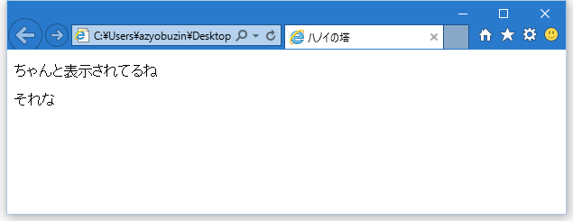

# 開発環境をつくる
「面倒なことはしない」が今回のモットーなので、特にインストールするものはありません。

## 作業用フォルダを作る
（発展問題までやらない限り1ファイルで完結するからフォルダ要らない説がある。）

まずはゲームに関係するファイルを入れておくフォルダを作ります。
学校のPCを使っている人は、ネットワークドライブに自分の領域があるはずなのでそこに作成しましょう。

## HTMLファイルを作る
今回のゲームはブラウザで動作させます。ブラウザはHTMLという形式で書かれた文章を認識して表示します。

まず、メモ帳を起動して、次の文章を書き写してください。

```html
<!DOCTYPE html>
<html>
<head>
<title>ハノイの塔</title>
</head>

<body>
<p>ちゃんと表示されてるね</p>
<p>それな</p>
</body>
</html>
```

これがHTMLです。呪文に見えますか？でもちゃんと法則があります。

`<>`で囲まれているのをタグと言い、これが命令の意味を表しています。
例えば`<title>`は、「これがこのページのタイトルだよ」ということを表しています。
タグは`</tag>`の形で必ず閉じられることに注意してください。ここでその命令を終了するよ、ということです。

それではこのファイルを作業用フォルダに保存してください。名前は「hanoi.html」とでもしましょう。
「.html」を最後につけることで、ファイルをダブルクリックしたときにブラウザで開けるようになるので、必ずつけてください。

## HTMLファイルを開く
保存した hanoi.html を開いてみましょう。このような画面になったら成功です。



## 発展問題
* 「.html」に関連して、「拡張子」について調べてみましょう。
* 「HTML」とは何の略でしょうか。その意味も考えてみましょう。
