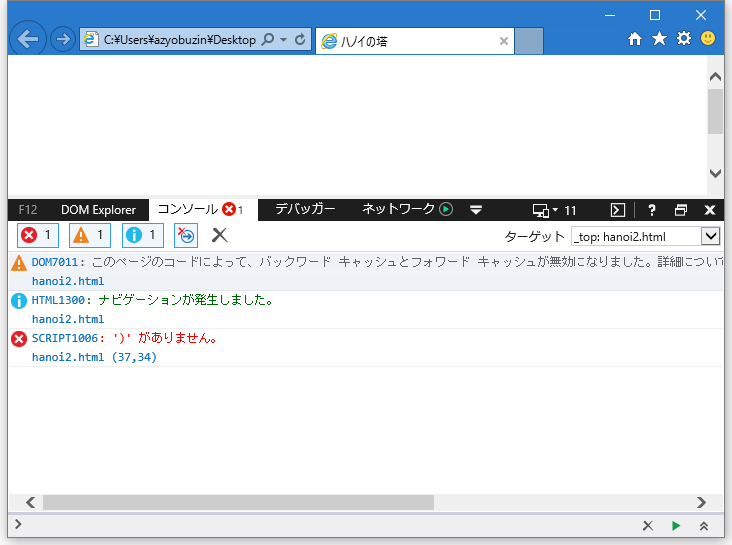

# うまく動かないときは

## 括弧の閉じ忘れがないかを確認しましょう
JavaScriptでは開いた括弧は必ず閉じます。
`(`があったらそれに対応する`)`が必要だし、`{`や`[`も同様です。

## コンソールを活用する
原因がわからないけれど、思うように動いてくれないときは、文法や関数の使い方が間違っていることがあります。
そんなときにはブラウザの開発者ツールを使うとヒントが得られるかもしれません。

基本的にどのブラウザでもF12キーを押すと開発者ツールが起動します。
コンソールタブを開いた状態で、ブラウザをリロード（更新）すると、エラーがあった場合に表示されます。

