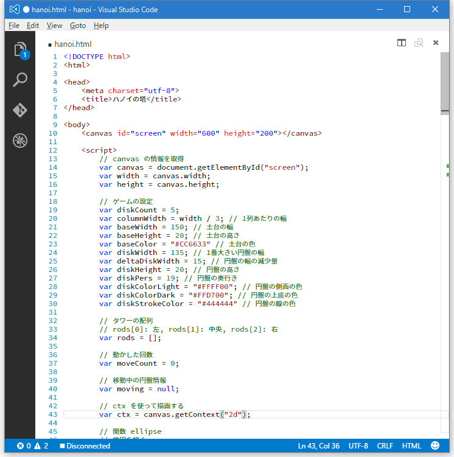

# 【おまけ】まだメモ帳で消耗してるの？
ある程度このチュートリアルを進めてからこのページを訪れた方はもう気づいたかと思いますが、メモ帳はプログラムを書くのには向いてませんね。

[エディタ戦争](https://ja.wikipedia.org/wiki/%E3%82%A8%E3%83%87%E3%82%A3%E3%82%BF%E6%88%A6%E4%BA%89)なんてものがあるように、エディタなんて個人の好きなものを使えばいいのですが、ここでは私からのおすすめを紹介します。

## Visual Studio Code

いかがでしょうか。コードの意味に合わせて色付けされてとても見やすくなりました。
さらに、スクリーンショットの43行目を見ると、括弧にカーソルを合わせると括弧の始まりと終わりが四角で囲まれ、わかりやすくなっています。

他にもいろいろと便利機能があるのですが、これだけでも脱メモ帳する価値はあると思います。お試しください（ダイレクトマーケティング）。

## ダウンロード
[公式サイト](https://code.visualstudio.com/)よりダウンロードすることができます。

学校のPCを使っている場合は、インストーラを動かすことができないので、ZIP版をダウンロードしてください。
[このページ](https://code.visualstudio.com/Docs/supporting/howtoupdate)の「If you have trouble with the Windows installer, download the VS Code zip file from here.」からZIP版をダウンロードすることができます。
